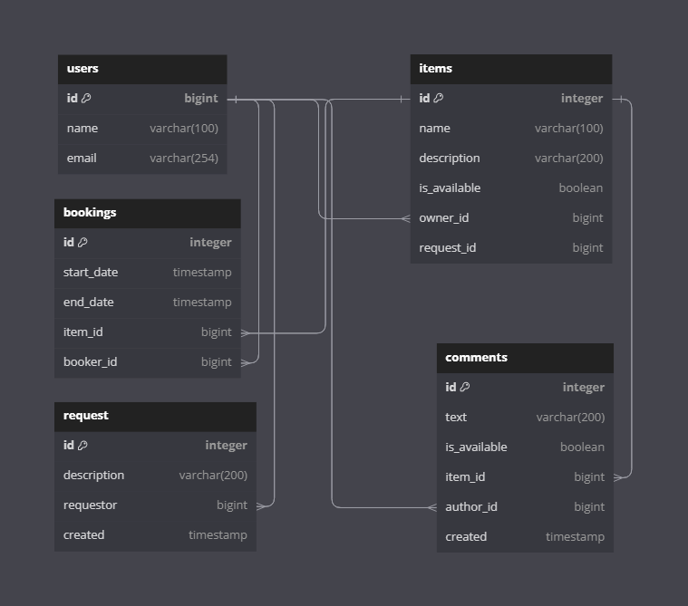

# java-shareit
## **Educational project. Message board for item sharing.**
#
## **The application consists of two microservices:**
###  1. Gateway - for receiving and validating user requests. The client forwards successful requests to the server.
###  2. Server - contains business logic. Works with the database using Hibernate. On a successful request, sends data through the gateway to the client. 

### [**Database schema**](https://dbdiagram.io/d/64d10c9502bd1c4a5e5fae17)

## All business logic and work with the database is presented in the server folder.
